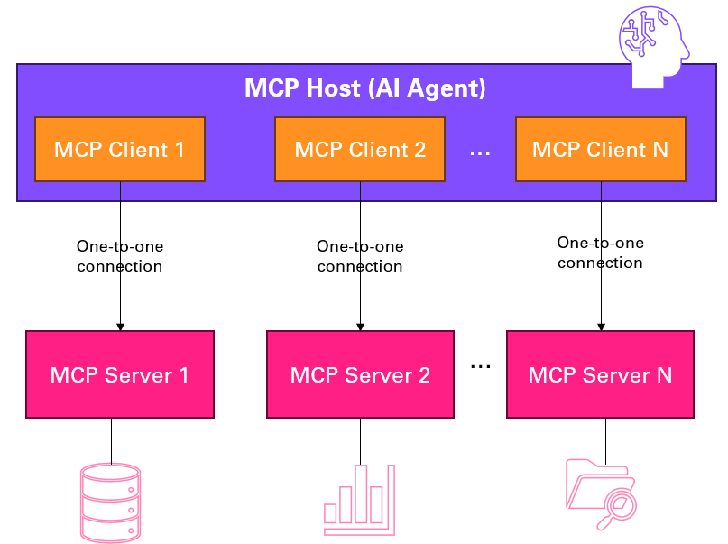

# MCP Security

Model context protocol (MCP) OAuth, security, authorization, authentication flows

## Setup context security


## Blogs

- [Implement a secure MCP server using OAuth and Entra ID](https://damienbod.com/2025/09/23/implement-a-secure-mcp-server-using-oauth-and-entra-id/)
- [Implement a secure MCP OAuth desktop client using OAuth and Entra ID](https://damienbod.com/2025/10/16/implement-a-secure-mcp-oauth-desktop-client-using-oauth-and-entra-id/)
- [Model Context Protocol in :NET](https://medium.com/@cedric.mendelin/model-context-protocol-in-net-06c6076b6385)
- [Developing an MCP Scenario with TypeScript: A production-ready reference implementation, Tobias Maestrini](https://tmaestrini.github.io/topics/developing-an-mcp-scenario-with-typescript-a-production-ready-reference-implementation)

## Presentation
- [AI Community Day Zurich - How to securely implement MCP with OAuth in .NET](./slides/AI-community-day-zurich-sept-25/MCP-Security-2025.pdf)
 

## Definitions




- LLM based AI Agent: An AI system that uses tools, prompts, LLMs, and MCPs to discover, reason, and act.
- MCP: A standardized interface for tool and resource integration
- MCP Host: The AI Application which wants to invoke tools on the MCP server.
- MCP Client: An agent-side component that accesses tools via MCP.
- MCP Server: A resource-side implementation of the MCP standard.
- Local Data Source: Locally stored data with built-in authn, authz, trust, and protection.
- Remote Services: Internet-based services with authn, authz, trust, and data protection.
- A2A (Agent-to-Agent): Communication or coordination between agents.
- RAG (Retrieval-Augmented Generation): AI generation enhanced by external data retrieval.
- LLM (Large Language Model): A model trained on vast text data to understand and generate language.
- Generative AI: Reactive AI that produces content based on existing models.
- Agentic AI: Proactive AI that perceives, decides, acts, and learns.
- Vector Database: A database optimized for storing and querying vector embeddings.
- AI Slop: Low-quality or irrelevant output generated by AI tools.

> [!IMPORTANT]  
> S in MCP: The "S" in MCP stands for Security

## MCP flow types

### Simple


### On Behalf Of


### Multi Client


### Multi Client, Multi Server


## Links and References
https://modelcontextprotocol.io/docs/getting-started/intro
https://modelcontextprotocol.io/specification/2025-06-18


## .NET MCP server

https://devblogs.microsoft.com/dotnet/mcp-server-dotnet-nuget-quickstart/

https://github.com/microsoft/mcp-dotnet-samples

https://learn.microsoft.com/en-us/dotnet/ai/quickstarts/build-mcp-server

## Standards, draft Standards

[OAuth 2.0 Dynamic Client Registration Protocol](https://datatracker.ietf.org/doc/html/rfc7591)

[OAuth 2.0 Authorization Server Metadata](https://datatracker.ietf.org/doc/html/rfc8414)

https://modelcontextprotocol.io/specification/2025-06-18/basic/authorization

https://modelcontextprotocol.io/specification/2025-06-18/basic/security_best_practices

https://github.com/modelcontextprotocol/modelcontextprotocol/issues/1299

https://den.dev/blog/mcp-authorization-resource/

### Learning Courses

https://github.com/microsoft/mcp-for-beginners


## SPIFFE

https://spiffe.io/docs/latest/spiffe-about/overview/

## Ready made MCP

https://mcp.azure.com/

https://github.com/microsoft/azure-devops-mcp

https://auth0.com/blog/an-introduction-to-mcp-and-authorization/

https://learning.postman.com/docs/postman-ai-agent-builder/mcp-server-flows/mcp-server-flows/

https://stytch.com/blog/MCP-authentication-and-authorization-guide/

## AI UI agents with OAuth support

https://github.com/daodao97/chatmcp

https://claude.ai/download

https://cursor.com/

Visual Studio code

Visual Studio

## Links

https://github.com/MicrosoftDocs/mcp

https://devblogs.microsoft.com/dotnet/mcp-csharp-sdk-2025-06-18-update/

https://modelcontextprotocol.io/docs/learn/architecture

https://github.com/SonarSource/sonarqube-mcp-server

https://den.dev/blog/mcp-authorization-resource/

https://den.dev/blog/mcp-csharp-sdk-authorization/

https://github.com/modelcontextprotocol/modelcontextprotocol/issues/1299

https://blog.cloudflare.com/building-ai-agents-with-mcp-authn-authz-and-durable-objects/

https://blog.aidanjohn.org/2025/07/30/mcp-a-new-frontier-in.html

https://medium.com/kagenti-the-agentic-platform/security-in-and-around-mcp-part-1-oauth-in-mcp-3f15fed0dd6e

https://medium.com/kagenti-the-agentic-platform/security-in-and-around-mcp-part-2-mcp-in-deployment-65bdd0ba9dc6

https://blog.christianposta.com/implementing-mcp-dynamic-client-registration-with-spiffe/

https://blog.christianposta.com/authenticating-mcp-oauth-clients-with-spiffe/

https://luke.geek.nz/azure/akahu-mcp-apim/

https://github.com/modelcontextprotocol/inspector

## Copilot Links

https://github.com/dotnet/AspNetCore.Docs/issues/35798

https://docs.github.com/en/copilot/how-tos/custom-instructions/adding-repository-custom-instructions-for-github-copilot

https://github.com/dotnet/docs-aspire/blob/main/.github/copilot-instructions.md

## Azure OpenAI 

https://learn.microsoft.com/en-us/azure/ai-foundry/

## Ready to use servers

https://mcpservers.org/

https://devblogs.microsoft.com/azure-sdk/introducing-the-azure-mcp-server/
 

## Azure App Service MCP server

https://github.com/Azure-Samples/remote-mcp-webapp-dotnet

## Testing MCP Client tool

```
npx @modelcontextprotocol/inspector
```

https://github.com/modelcontextprotocol/csharp-sdk/blob/main/samples/ProtectedMcpClient/Program.cs

https://github.com/Azure-Samples/ms-identity-dotnet-desktop-tutorial/blob/master/1-Calling-MSGraph/1-1-AzureAD/Console-Interactive-MultiTarget/Program.cs

## App registrations

**Http MCP Server**

- ClientID: 96b0f495-3b65-4c8f-a0c6-c3767c3365ed
- TenantID: 5698af84-5720-4ff0-bdc3-9d9195314244
- Scope: api://96b0f495-3b65-4c8f-a0c6-c3767c3365ed/mcp:tools

**Http MCP Client**

- ClientID: 344677a4-a975-4cba-a4b0-2d0771847938
- TenantID: 5698af84-5720-4ff0-bdc3-9d9195314244
- Scope: api://96b0f495-3b65-4c8f-a0c6-c3767c3365ed/mcp:tools
- Secret: 
- RedirectUrl: https://localhost:5001/signin-oidc

**Http MCP Desktop Client**

- ClientID: eff6bb0e-9871-458f-92ea-923c02250a05
- TenantID: 5698af84-5720-4ff0-bdc3-9d9195314244
- Scope: api://96b0f495-3b65-4c8f-a0c6-c3767c3365ed/mcp:tools
- RedirectUri: http://localhost
